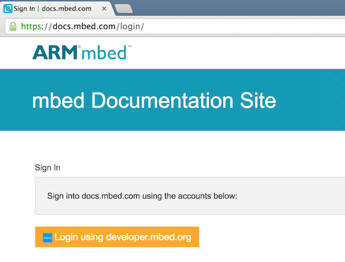
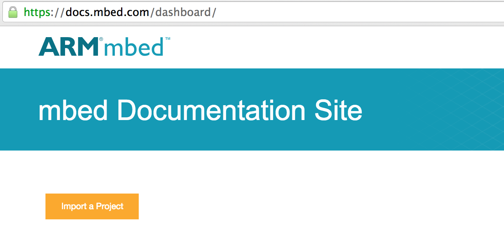
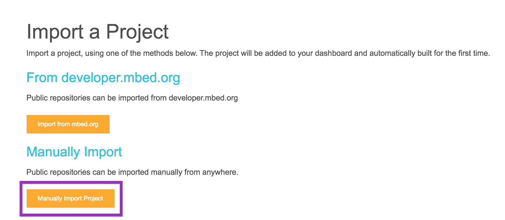
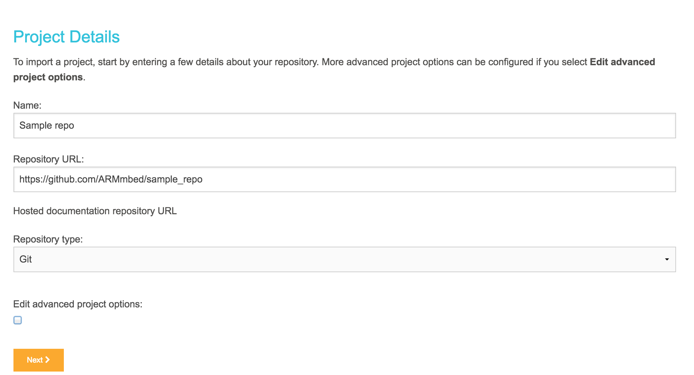
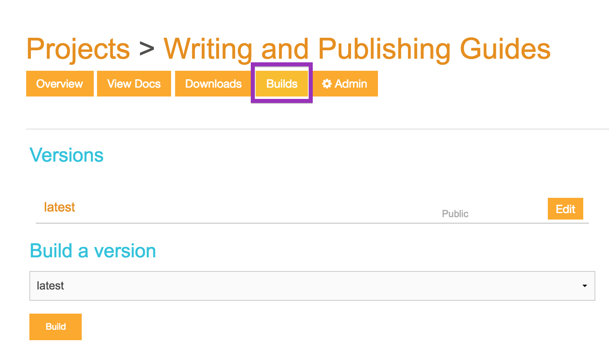

# Creating a project on docs.mbed.com

Documentation living on GitHub can be published on [docs.mbed.com](http://docs.mbed.com) using your mbed account:

1. Log into docs.mbed.com with your **developer.mbed.org** credentials.

    Logging in

1. You are taken to your dashboard.

1. Click **Import a Project**.

    Import

1. You have two importing options. Click **Manually Import Project**.

    Manually import

1. Name your project and enter the GitHub repo URL.

    Project details

1. Review the other options. The default values may well be all you need.

1. Click **Next**. You are taken to the project page.

1. The project tries to build a first version as soon as it's created. Click **Builds** to see the build's progress. 

    Project home page

1. When the build is done, you can click **View Docs** to see your project. 

**Tip:** Your project's Admin page allows adding tags to your projects (as comma-seperated words). Tags help users find your documents, so we recommend using them.
