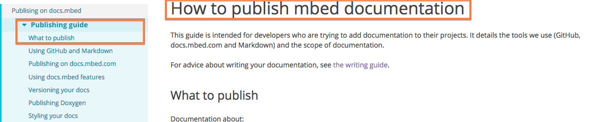
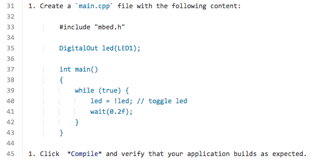
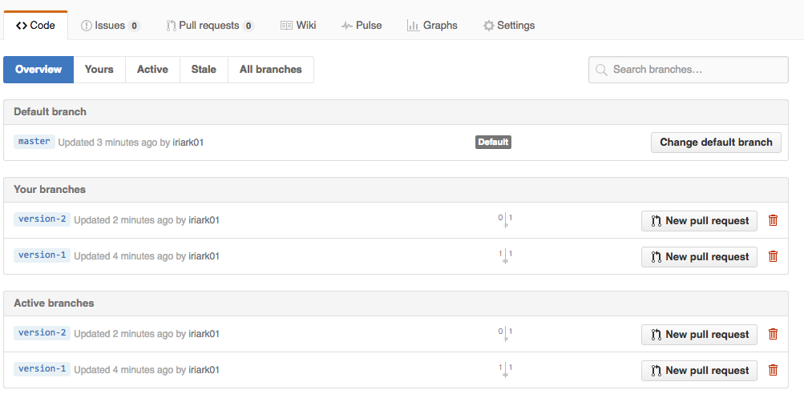
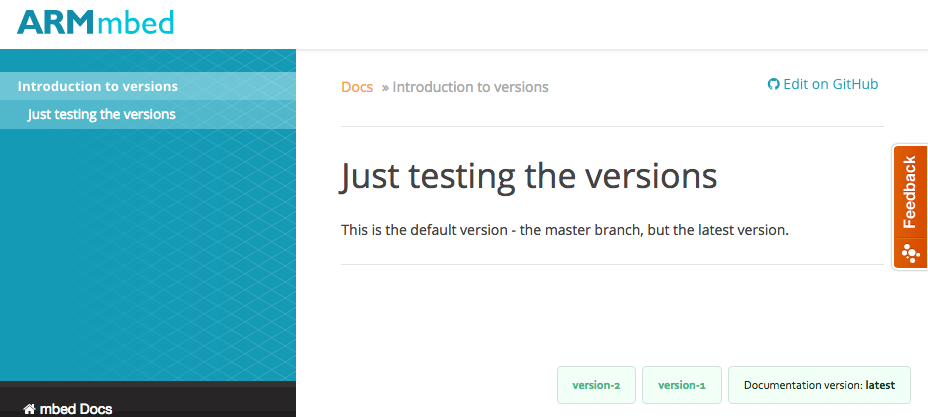
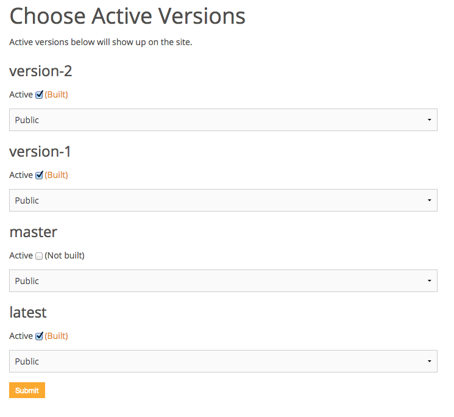

# How to publish mbed documentation

This guide is intended for developers who are trying to add documentation to their projects. It details the tools we use (GitHub, docs.mbed.com and Markdown) and the scope of documentation.

For advice about writing your documentation, see [the writing guide](writing_guide.md).

## Using GitHub, MkDocs and Markdown

Our documentation is written in Markdown and lives on GitHub. We use the [MkDocs engine](http://www.mkdocs.org/). Read [their documentation](http://www.mkdocs.org/#getting-started) to learn about how they structure a project. 

<span class="tips">**Tip:** MkDocs review [basic Markdown syntax](http://www.mkdocs.org/user-guide/writing-your-docs/) on their site.</span>

Your docs should sit in the same GitHub repository as the code whenever possible. You will need to create:

* A `docs` folder.
* An ``mkdocs.yml`` file that sits in the root of the directory.

### Using the YML to create the project and its table of contents

We use the **old YML format** to organize pages. For example, this is the YML for the project you're currently reading:

```
site_name: Documentation Guides

docs_dir: Docs

- ['index.md','Introduction to the Documentation Guides']
- ['publishing_guide.md', 'Publising on docs.mbed', 'Publishing guide']
- ['project.md', 'Publising on docs.mbed', 'Creating your own project']
- ['style_guide.md', 'Style Guide', 'Introduction']
- ['words.md', 'Style Guide', 'Word choices and grammar']
- ['punc_cap.md', 'Style Guide', 'Punctuation and capitalization']
- ['tech_terms.md', 'Style Guide', 'Technical terms']
- ['product_names.md', 'Style Guide', 'Product names']
- ['units.md', 'Style Guide', 'Units of measurement']
- ['writing_guide.md', 'Writing Guide', 'Introduction']
- ['writing_tips.md', 'Writing Guide', 'Writing tips']
- ['maps.md', 'Writing Guide', 'Creating a map before you write']
- ['fleshing_out.md', 'Writing Guide', 'Fleshing out your map']
- ['examples.md', 'Writing Guide', 'How to give examples']
- ['Editing.md', 'Writing Guide', 'Editing yourself']
```

In ``pages``, the elements are:

1. ``Page_name.md``.
1. Section title (not mandatory; the first page in this project isn't under a section title).
1. Page title.

<span class="tips">**Tip:** The table of contents on docs.mbed shows the page title from the YML *instead of* header 1; header 1 is shown only as part of the text. This prevents having two page titles - one from the YML and one from header 1 - appearing together in the table of contents.

<span class="images"><span>The table of contents shows the page title from the YML, not header 1.</span></span></span>

## Markdown syntax on docs.mbed

The Markdown engine we use on docs.mbed - [MkDocs](http://www.mkdocs.org/user-guide/writing-your-docs/) - doesn't use exactly the same syntax as GitHub. This means that some things that look good on GitHub don't render correctly on docs.mbed. To get proper rendering on docs.mbed, you need to adjust your syntax a little.

Note that adjusting your syntax to match docs.mbed doesn't damage the text's appearance on GitHub, because GitHub supports both syntaxes.

### Code blocks within lists

If you want to have a code block in a numbered list, you can't use the fencing ``` syntax. Instead:

* You need an empty line before and after the code block.
* Use eight spaces (not Tab) to start the block.
* Use four more spaces (again - not Tab) for each indent the code requires.

Here's an example: 

<span class="images"><span>Count the indents</span></span>

It renders as:

1. Create a `main.cpp` file with the following content:

        #include "mbed.h"

        DigitalOut led(LED1);

        int main()
        {
            while (true) {
                led = !led; // toggle led
                wait(0.2f);
            }
        }

1. Click  *Compile* and verify that your application builds as expected.  

### Lists with more than one level

If you want a list to render with more than one level of numbers or bullets, you need to use four spaces instead of Tab:

1. Level one first item
    1. Level two first item
    1. Level two second item
1. Level one second item

### Styling your docs

The docs.mbed engine supports the following syntax:

1. ``<span class="notes">This is what a note looks like</span>``
	<span class="notes">This is what a note looks like</span>
1. ``<span class="tips">This is what a tip looks like</span>``
	<span class="tips">This is what a tip looks like</span>
1. ``<span class="warnings">This is what a warning looks like</span>``
	<span class="warnings">This is what a warning looks like</span>
1. ``<span class="images"><span>caption</span></span>``
	<span class="images"><span>This is what an image looks like</span></span>

<span class="notes">**Note:** If you're reading this on GitHub you will see the default GitHub styling, not our styling.</span>

## docs.mbed special features

docs.mbed offers a few features that aren't normally available on GitHub-flavoured Markdown.

### Including pages from other repos

If you're working with several repos, but want to publish all of their docs under one docs.mbed project, you can do that without duplicating pages.

1. Create your MD pages in whatever repos you want. Let's say ``source_repo/docs/source.md``.
1. In the repo you want to publish, create an empty MD or use an existing MD. For example ``publishing_repo/docs/publish.md``.
1. Get the link to the *raw* GitHub MD page from the source repo.
1. Paste the raw link in the publishing repo, preceded by an exclamation mark and held within curly brackets:

	``!{https://raw.githubusercontent.com/ARMmbed/source_repo/master/docs/source.md}``

1. Publish your repo.

Note that you cannot include parts of a page - you can only include the whole page.

You can see an example of this in the [uVisor_docs repo](https://github.com/ARMmbed/uvisor_docs).

<span class="notes">**Note:** you must republish your repo to show changes in the source repos.</span>

### Including code

Code transclusion follows the same logic as page transclusion above; the difference is only in the syntax itself, which is like a maths exercise: 

1. ``[](3)``
2. ``(https://www.mbed.com/embed/?url=repo_URL)``
3. ``(https://github.com/full_path_to_code_file.cpp)``

That gives you 

```
[](https://developer.mbed.org/teams/mbed-os-examples/code/mbed-os-example-blinky/file/tip/main.cpp)
```

On GitHub, you'll see only a button; on docs.mbed you'll also see the code itself.

It's a good idea to transclude code from a branch that is not Master. If you transclude from Master the code will always be up to date - even if your docs are now a frozen version that should show the older code.

## Versioning your docs

docs.mbed supports publishing several versions of a project, and lets the users flip between versions as they read. 

### Creating branches for documentation

The basis for document versions is GitHub branches - so think before you name your branches, because that is what the users will see on docs.mbed.

These are my branches:

<span class="images"></span>

And this is what the version picker looks like when I build my versions:

<span class="images"></span>

### Selecting branches to publish

If you have more than one branch, docs.mbed will offer you a list of branches to build in **Dashboard > Admin > Versions**:

<span class="images"></span>

In the **Choose Active Versions** section, check the branches you want to build. You can remove them any time you like.

<span class="notes">**Note:** For an existing project, you may have to trigger a build to refresh the list of available versions.</span>

### Building a branch

In the project's **Build** page, the **Build version** drop-down lets you choose which version to build.

## Publishing Doxygen

docs.mbed will try to build Doxygen for your repository along with the regular documentation, so you should follow the previous section's instructions for publishing Markdown.

Note:

1. Please follow the general [Doxygen guidelines](http://www.stack.nl/~dimitri/doxygen/) to write your comments.
1. To generate a main page for your Doxygen, please create a markdown file in your repository's root called ``DOXYGEN_FRONTPAGE.md``.


